# 架构设计

## 总体架构

## 技术栈
- **前端:** Angular 18 (独立组件) / SCSS / Bootstrap 5
- **可视化:** Cytoscape + dagre 布局
- **数据:** 前端 mock JSON，后续可接入后端 API

## 核心流程

```mermaid
sequenceDiagram
    User->>TreeList: 选择族谱
    TreeList->>Router: 导航到 /trees/:id
    Router->>Genealogy: 加载族谱详情并渲染 Cytoscape
    User->>Profile: 查看个人中心
```

## 重大架构决策
完整的 ADR 存储在各变更的 how.md 中，本章节提供索引。

| adr_id | title | date | status | affected_modules | details |
|--------|-------|------|--------|------------------|---------|
| ADR-001 | 路由分层与特性模块化 | 2025-12-06 | 📝规划中 | Genealogy, TreeList, Profile | history/2025-12/202512061046_genealogy_nav/how.md#adr-001 |
